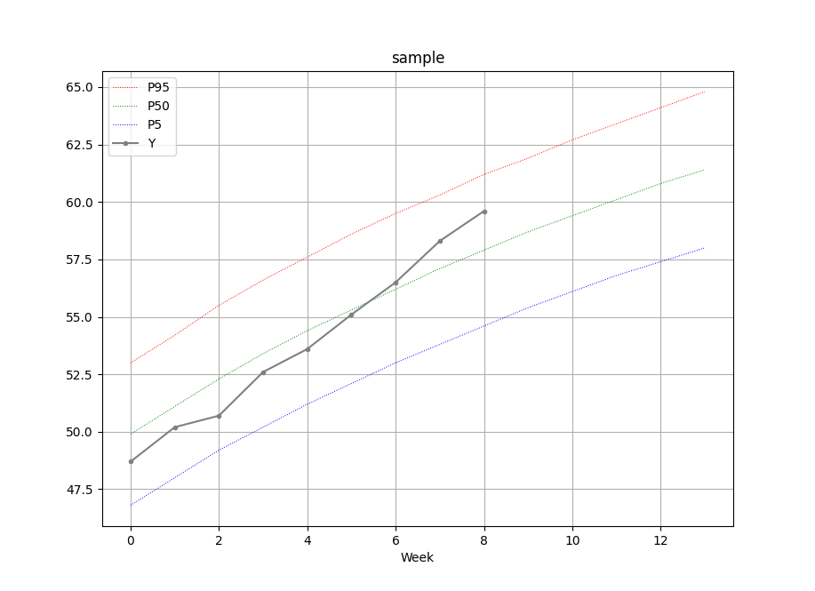

# Plot Child Growth Against WHO Standard Percentiles

WHO provides [child growth standards][WHO std] for various measures. For example, the Excel table [Boys table- Length-for-age: Birth to 13 weeks (percentiles)][WHO lhfa] provides boy's length percentiles from week 0 to 13, and [Girls table- Weight-for-length: Birth to 2 years (percentiles)][WHO wflh] provides girl's weight percentiles at different lengths[^1]. This project aims to help plot actual data points against standard percentiles for comparison.

## Measure and Record

Download desired percentile Excel tables from [WHO site][WHO std]. Measure and record actual data points in the same Excel tables alongside the standard percentiles. Follow different practices for time-series measure and non-time-series measure.

### Time-Series Measure

Time-series measures are those for age (week/month), like length for age. X-axis represents age. Actual data points are measured at the same ages as standard percentiles. Since X-axis values are shared, only Y-axis values need to be recorded. So add a new column labeled `Y` to the right in the Excel table. For example,

| Week  |  P5   |  P50  |  P95  |   Y   |
| :---: | :---: | :---: | :---: | :---: |
|   0   | 46.8  | 49.9  |  53   |  50   |
|   1   |  48   | 51.1  | 54.2  |  51   |
|   2   | 49.2  | 52.3  | 55.5  |       |

`P5`, `P50`, `P95` are 5%, 50%, 95% percentiles, and `Y` is actual measures. All share the same X-axis values in `Week`. `Y` usually has less rows as further measures are yet to come.

### Non-Time-Series Measure

Non-time-series measures are those not sampled by age, like weight for length (not age). Actual data points do not share the same X-axis values with standard percentiles. So both X- and Y-axis values must be recorded. Add two new columns labeled `X` and `Y` to the right in the Excel table. For example,

|Length |  P5   |  P50  |  P95  |   X   |   Y   |
| :---: | :---: | :---: | :---: | :---: | :---: |
|  45   |  2.1  |  2.4  |  2.9  | 45.3  |  2.3  |
| 45.5  |  2.2  |  2.5  |  2.9  | 45.5  |  2.4  |
|  46   |  2.3  |  2.6  |   3   | 45.7  |  2.6  |
|       |       |       |       |  46   |  2.8  |

The percentiles `P5`, `P50`, `P95` are aligned to `Length` while actual measure `Y` is aligned to `X`. Since `Length` and `X` are independent, there can be more rows of `Y` than percentiles.

## Plot

Plot with `plot.py --path PATH [--margin {3,5,10}]`.

- `path`: Path to the Excel table file to plot.
- `margin`: Plot actual data points along with percentiles `P(margin)`, `P50`, `P(100-margin)` for comparison. Default is `5`.

For example, the following chart is plotted with `plot.py --path sample`.

Finally, plot well and have a happy healthy baby :heart:

[^1]: Child under 2 years is measured by length rather than height.

[WHO std]: https://www.who.int/tools/child-growth-standards/standards
[WHO lhfa]: https://www.who.int/tools/child-growth-standards/standards/length-height-for-age
[WHO wflh]: https://www.who.int/tools/child-growth-standards/standards/weight-for-length-height
